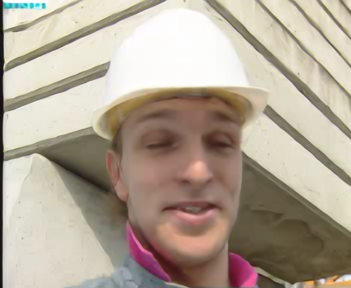
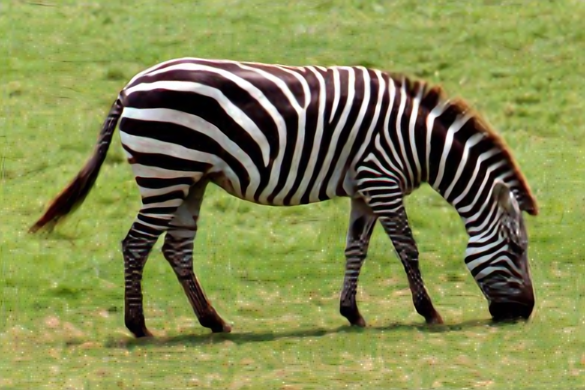
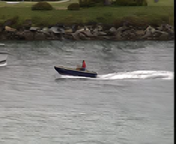
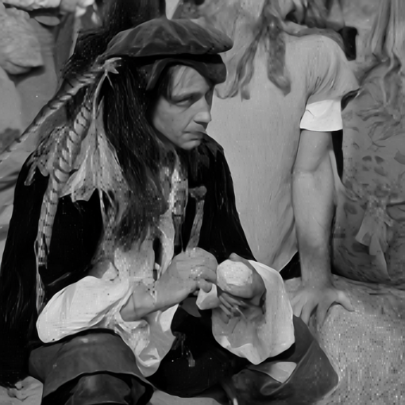

# Image super-resolution
Implement image super-resolution with [SRFBN](https://github.com/Paper99/SRFBN_CVPR19).


## Hardware
The following specs were used to create the original solution.
- Ubuntu 16.04 LTS
- Intel(R) Core(TM) i7-9800X CPU @ 3.80GHz
- 1x NVIDIA TITAN RTX

## Requriments
- Python 3 (Anaconda is recommended)
- skimage
- imageio
- Pytorch (Pytorch version >=0.4.1 is recommended)
- tqdm 
- pandas
- cv2 (pip install opencv-python)
- Matlab 

## Dataset
Download the dataset [here](https://drive.google.com/drive/u/0/folders/1H-sIY7zj42Fex1ZjxxSC3PV1pK4Mij6x).

After downloading the dataset, the data directory is structured as:
```
SRFBN_CVPR19-master
  └── dataset
        ├── training_hr_images
        |    ├── 100075.jpg
        |    ├── 100080.jpg
        |    └── ...
        └── testing_lr_images
              ├── 00.jpg
              ├── 01.jpg
              └── ...
```

## Data augmentation
Run the command in Matlab:
```shell
./scripts/Prepare_TrainData_HR_LR.m
```

or just run the command in the shell:
```shell
matlab -nodisplay -nosplash -nodesktop -r "run('scripts/Prepare_TrainData_HR_LR.m');exit;" | tail -n +11` 
```

to generate HR/LR training pairs with corresponding degradation model and scale factor. (**Note**: Please place generated training data to **SSD (Solid-State Drive)** for fast training)

## Pretrained model
**No** pretrained model is used! I train the model from scratch.

## Training
1. Edit `./options/train/train_SRFBN_example.json` for your needs according to [this](https://github.com/Paper99/SRFBN_CVPR19/blob/master/options/train/README.md).

2. To train a model from scratch, run the following command:
```shell
$ python train.py -opt options/train/train_SRFBN_example.json
```

## Make Submission
1. Edit `./options/test/test_SRFBN_example.json` for your needs according to [this](https://github.com/Paper99/SRFBN_CVPR19/blob/master/options/test/README.md).

2. Then, run command:
   ```shell
   $ cd SRFBN_CVPR19-master
   $ python test.py -opt options/test/test_SRFBN_example.json
   ```

3. Finally, you can find the reconstruction images in `./results/SR/testing_lr_images/SRFBN/x3`.
```
x3
 ├── 00.png
 ├── 01.png
 └── ...
```

4. Put all the images to your own folder in the [google drive link](https://drive.google.com/drive/folders/1sbb527to9S8Ej-25QOb0IrQ-d2TDBcYK).

## Results
I got the PSNR 25.831 dB for x3 upscaling.












## Reference
- https://github.com/Paper99/SRFBN_CVPR19
